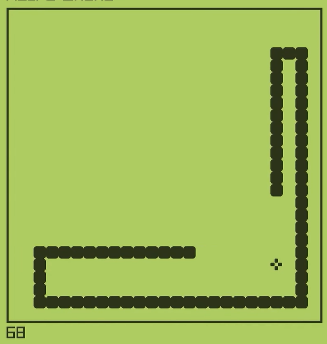

# Snake Raylib

A classic Snake game implemented using **Raylib**. This project showcases object-oriented programming, custom textures, and sounds, delivering a fun and polished gaming experience.

---



---

## Features

- **Smooth Gameplay**: Consistent frame rate and interval-based movement.
- **Collision Detection**:
  - Detects when the snake eats food.
  - Checks for collisions with walls and the snake's own tail.
- **Custom Graphics and Sounds**:
  - Textured food and snake body.
  - Sound effects for eating and collision events.
- **Score Tracking**: Displayed on the screen dynamically.
- **Reset Mechanism**: Automatic reset on game over.
- **Pause Functionality**: Easily pause and resume the game (future feature).

---

## How to Play

1. Use the **Arrow Keys** to control the snake's direction.
2. Guide the snake to the food to grow its size and increase your score.
3. Avoid hitting the edges or your own tail to keep playing.
4. Press **Space** to pause or resume the game.

---

## Installation

### Prerequisites

- **Raylib**: Install Raylib on your system. You can use the [official guide](https://github.com/raysan5/raylib).
- A C++ compiler (e.g., GCC, MSVC).

### Steps

1. Clone the repository:
   ```bash
   git clone https://github.com/raghavtandon13/snake-raylib.git
   ```
2. Compile the code:
   ```bash
   g++ -o snake_game main.cpp -lraylib -lopengl32 -lgdi32 -lwinmm
   ```
   Replace the libraries as per your system requirements.
3. Run the game:
   ```bash
   ./snake_game
   ```

---

## Project Structure

```
.
├── Graphics/
│   └── food.png         # Food texture
├── Sounds/
│   ├── eat.mp3          # Eating sound effect
│   └── wall.mp3         # Collision sound effect
├── main.cpp             # Game logic and implementation
└── README.md            # Documentation
```

---

## Controls

| Key             | Action                |
| --------------- | --------------------- |
| **Arrow Up**    | Move Snake Up         |
| **Arrow Down**  | Move Snake Down       |
| **Arrow Left**  | Move Snake Left       |
| **Arrow Right** | Move Snake Right      |
| **Space**       | Pause/Resume the game |

---

## Future Enhancements

- **Dynamic Difficulty**: Increase game speed with higher scores.
- **Wrap-Around Mode**: Allow the snake to move through walls and appear on the opposite side.
- **Obstacles**: Introduce new challenges to make the game more engaging.
- **Multiplayer**: Add support for two-player gameplay.
- **High Score Tracking**: Save high scores to a file for persistence.

---

## Credits

- Developed by: [Raghav](https://github.com/raghavtandon13)
- Built with: [Raylib](https://www.raylib.com/)
